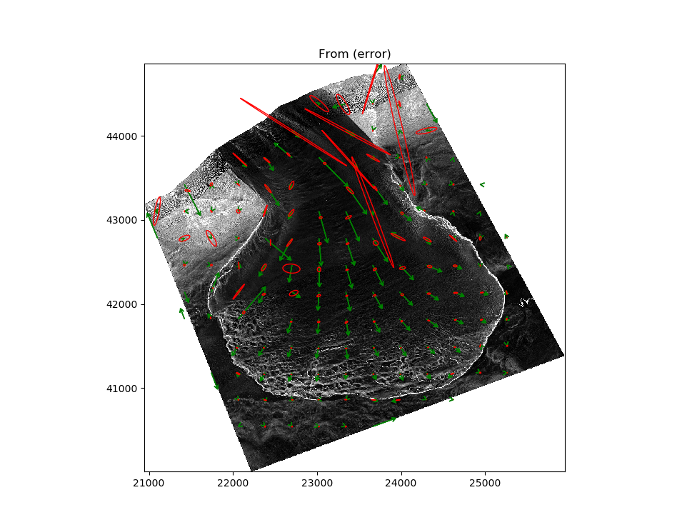

# GPIV - Geospatial Particle Imaging Velocimetry

## Description
There are plenty of PIV applications out there, but none focused on the geospatial community with built in error propagation. Hence, GPIV. GPIV is a command line tool that generates horizontal displacment vectors from two temporally spaced digital elevation models (DEMs) where some type of horizontal motion has occurred between the data collections. In contrast to certain PIV applications that restrict (or convert) input images to 8-bit integer format, GPIV natively operates on floating point values. As of now, GPIV can:

* Rasterize a lidar point cloud to a height raster and error raster (more on the error raster below).
* Generate 2D displacement vectors from two height rasters via the PIV method.
* Propagate pixel error (from the error raster) into the 2D displacement vectors.
* Display resulting PIV vectors and propagated error ellipses on either a height raster or error raster.  

The error raster that GPIV currently produces when rasterizing a lidar point cloud is simply the the standard deviation of lidar point elevations within each raster cell. This is not correct, but it provides a way to test the error propagation for now.

## Status
I'm not sure this is even in Beta stage yet. The PIV and error propagation works, but the PIV is very basic (single pass, no window deformation) and the error propagation is slooow. There are no tests yet.

Next steps in development will be validating the error propagation on synthetic data, looking at the error propagation speed problem, and then taking a first stab at what appears to be a difficult question: "How do we estimate the vertical uncertainty in each cell of a DEM generated from lidar data?". This question needs to be answered in order to generate correct estimates of the PIV displacement errors. And somewhere in the midst of this I need to figure out how to package this sucker so users can do a `conda install gpiv` or similar. Also need to standardize things to PEP8.

## Usage
### Dependencies
Use the `environment.yml` file to create a new environment with all the dependencies: `conda env create -f  environment.yml`.

### Command Line
* Type `python gpiv.py --help` to see available commands and options. 
* You will notice a lot of 'from' and 'to' verbiage. 'From' indicates the older data, whereas 'to' indicates the newer data. The vectors will point from the older data to the newer data. 
* GPIV stores rasters in geotiff format in the working directory (which is gpiv/gpiv for now since we are working with the source files, i.e., this is not at package install) with specific names. Displacement vectors and associated covariance matrices are exported in JSON format to the working directory as well. Don't rename the files since GPIV relies on their given names. Copy them to a new place if you want to save a particular version of the results.

## Rudimentary Example
* Canada glacier.
* Displacment vectors (green) are scaled by a factor of 5.
* Error ellipses (red) are 1-sigma and scaled by a factor of 20.

