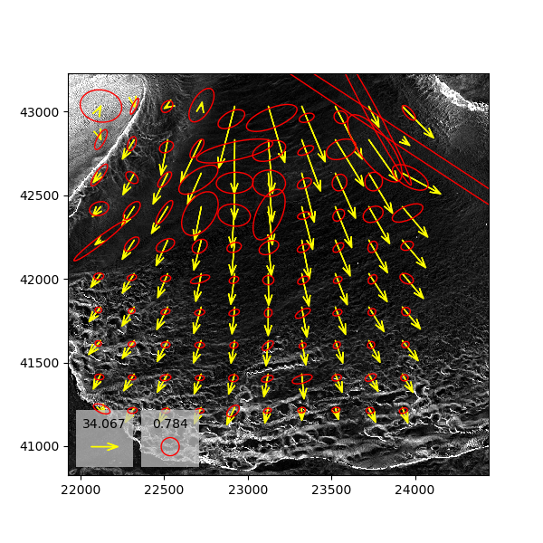

# Uncertainty propagation through Raster Correlation  using GPIV
This is an update to the original repository by Preston Hartzell accessible at [this repo](https://github.com/pjhartzell/GPIV).

The main updates made to the original repo are as follows;
1- The inputs do not have to be in GeoTiff format. The inputs are now point clouds that have full covariance matrices.
2- User needs to modify input parameters as well as window aize and step size in run_test_v1.py
3- The uncertainty of each raster grid is calculated by propagating the total uncertainty of points forming the TIN triangle that contains the grid cell.

You can read the original readMe below:

# GPIV - Geospatial Particle Imaging Velocimetry

## Description
There are plenty of PIV (image correlation) applications out there, but none focused on the geospatial community and none with built-in uncertainty propagation. Hence, GPIV. GPIV is a command line tool that generates horizontal displacment vectors from two temporally spaced digital elevation models (DEMs) where some type of horizontal motion has occurred between the data collections. In contrast to certain PIV applications that restrict (or convert) input images to 8-bit integer format, GPIV natively operates on floating point values. This makes it realistic to use DEMs with more than a few tens of meters of topographic relief. As of now, GPIV can:

* Generate 2D displacement vectors from pre- and post-event DEMs via image correlation.
* Propagate pre- and post-event DEM uncertainties (contained in images of the same size as the DEMs) into the 2D displacement vectors.
* Display the computed displacement vectors and propagated uncertainty ellipses on a background image.  

## Status
* Version = 0.1
* Recent testing has indicated the propagated uncertainties are correct for simple translations between the pre- and post-event DEMs. However, the propagated uncertainties are too small when a DEM undergoes distortion, which is more realistic. This may be a result of not using a multi-pass deforming window approach, which is the next item on the agenda.
* No automated tests yet, which is probably a silly statement considering the project is a lot of scratchwork thus far, but it is a practice I need to learn.
* The uncertainty propagation is still slow, though better than in Version 0.0. 
* The ELEPHANT in the room is how to generate statistically valid DEM uncertainties (that can be generated with minimal user interaction) for the propagation. Once the uncertainty propagation is fully validated, this will be the next order of business. 

## Installation
* Clone this repository: `git clone git@bitbucket.org:pjh172/gpiv.git` or `git clone https://pjh172@bitbucket.org/pjh172/gpiv.git`.
* I use Conda for my Python environments. Use the `gpiv.yml` file to create a new environment with all the required dependencies: `conda env create -f  gpiv.yml`.
* Run `pip install .` from within the `gpiv` directory to install GPIV.
* Type `gpiv --help` to see available commands and options. Type `gpiv piv --help` for PIV arguments and options and `gpiv pivshow --help` for arguments and options for plotting the PIV results.

## Example Application
An image showing the results from PIV and uncertainty propagation applied to Canada Glacier (Antarctica) motion between 2001 and 2015 is shown below. The displacement vectors are valid, but the absolute magnitudes of the uncertainty ellipses are not. However, the relative magnitudes and orientations of the ellipses are likely good estimates. The reason for the "incorrect" results is that the DEM uncertainties were generated from the standard deviation of the lidar points falling within each DEM grid cell, which is just a simplistic roughness estimate. Note that the background image is the roughness estimate. You can replicate the results using the DEM and uncertainty images in the `example_data` directory and running the following two commands:

* `gpiv piv example_data/height_2001.tif example_data/height_2015.tif 40 40 --prop example_data/uncertainty_2001.tif example_data/uncertainty_2015.tif`
* `gpiv pivshow example_data/uncertainty_2001.tif --vec vectors.json --ell covariances.json --ellscale 0.75`

